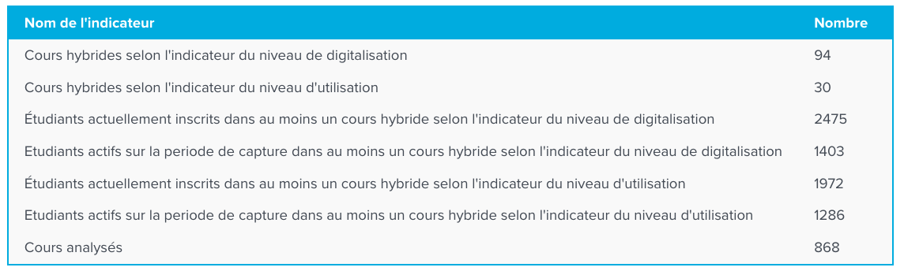

# HybridMeter

## Description

HybridMeter is a plugin dedicated to monitor the use of digital teaching tools within a Moodle LMS platform,
in order to collect standardized hybridization indicators on a regular basis. 
The plugin has been developed by ISAE-SUPAERO, in the context of the "THE Campus" and "OHE Campus" projects, 
in response to an ANR/Hybridation call. 
These projects are led by the University of Toulouse and involves all its institutions.

The aim is to propose an automated system that would enable automatic measurements about the presence and 
the usage of digital in the Moodle platform. 
It is assumed that Moodle is used as the school's teaching hub.  
It is assumed that the platform will centralize all the courses in the institution's training programs.

Two complementary indicators are computed:
* _The level of digitalization_ : this is a measure calculated on the basis of activities in course spaces. 
It is based on their number, diversity and hybrid nature. 
A threshold determines whether the course is then counted as "digital hybrid" or not.
* _The level of use_ : this is the level of digitalization coupled with the use of activities by the course's students. 
Each course space included in the measurement is analyzed, and the indicator now includes not only the activities, 
but also the use of the activities by the students in each course.

These indicators are used to calculate :
* The number of hybrid courses according to level of digitalization, 
applying a threshold below which courses are not counted.
* The number of hybrid courses according to level of use, by applying a threshold below which courses are not counted.

> Only the administrator profile of the Moodle platform the plugin is installed will have access to the results, 
whether global or detailed by course. 
No information is stored in the local database, and no information leaves the platform.

As a result, a set of aggregated results concerning the analysis of the platform's course spaces is displayed 
directly on the plugin page:

The software is delivered free of charge, along with the source code and this documentation, 
as part of a best-effort approach on the part of the development team. 
It is your responsibility to check that the delivered code corresponds to your expectations. 
The software can be used as is, and can be modified, without any guarantee that it will run on your platform.

More information about Hybridmeter : https://online.isae-supaero.fr/hybridmeter (in French).

## Installation
### Requirements
Moodle 3.5.7 or later (HybridMeter has been tested with Moodle up to 4.2.2).
### Install procedure
* Download the last version of the plugin [here](https://online.isae-supaero.fr/resources/hybridmeter/download/report_hybridmeter.zip).
* As a Moodle admin, install the plugin as any other plugin

Note : only Moodle admins can access to the plugin functionalities.

## Documentation
The following doc resources are currently available only in French :
* [Install and setup](doc/doc_installation.md)
* [User documentation](doc/doc_utilisateur.md)
* [Functional documentation](doc/doc_fonctionnelle.md)
* [Developer documentation](doc/doc_developpeur.md)
* [FAQ](doc/faq.md)

## Web site
The French website of HybridMeter is available at : [https://online.isae-supaero.fr/hybridmeter](https://online.isae-supaero.fr/hybridmeter) \

## Source code
The source code of HybridMeter is publicly available on [GitHub](https://github.com/ISAE-SUPAERO-IDEA/moodle-report_hybridmeter).

## ChangeLog
The change log is available [here](CHANGES.md).

## Support and Suggestion
If you encounter any issues or have suggestions for improvements, please feel free to [open issues on GitHub](https://github.com/ISAE-SUPAERO-IDEA/moodle-report_hybridmeter/issues).

## Copyright
Copyright ISAE-SUPAERO for this plugin is licensed under the GPLv3 license. [GNU AFFERO GENERAL PUBLIC LICENSE v3](LICENSE.md).